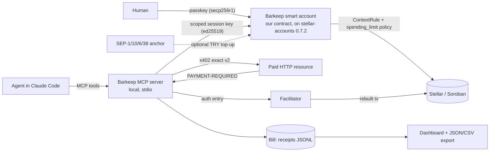

# Architecture v2 — Barkeep

**Status:** plan only. This document changes no code. The rename from PromptRail
to Barkeep is Phase B and is not started here.

**Update 2026-09-12:** Phase B is complete. The rename to Barkeep has landed —
package identity, UI copy, meta tags and docs. The two sentences above are kept
as written, because they were true when this plan was drafted. The v1 design
below is still a plan and remains unbuilt.

**Date:** 2026-09-12. Written against HEAD `f260482`.

Barkeep is a tab for AI agents on Stellar. A human opens a tab with a spending
cap and a time window, an agent spends against it to pay for HTTP requests, and
every payment lands on an itemised bill. The cap is enforced on-chain, by a
contract, not by the agent and not by the MCP server.

That contract is **ours**. It is built on OpenZeppelin's `stellar-accounts`
library, but the deployed code is written in this repository and has not been
audited by anyone. Section 4.1 says exactly what is deployed and what the
upstream audits do and do not cover.

---

## 1. Constraints

These are hard rules for every decision below.

1. **Apache-2.0 only.** The project's own code stays Apache-2.0 (`LICENSE`,
   `NOTICE`, commit `f2e544f`).
2. **No AGPL, GPL, LGPL, SSPL or BUSL in the shipped bundle**, including
   transitive dependencies. This much is enforced today:
   `build/third-party-licenses.ts` runs an SPDX allow-list over every package
   whose code reaches a chunk, plus a completeness check, and emits
   `/third-party-licenses.txt`. Any new dependency must pass that gate.
   **The installed tree is not clean yet, and the gate does not cover it.**
   `npm ci` still installs GPL-3.0 `@lobstrco/signer-extension-api`, unlicensed
   `@creit.tech/xbull-wallet-connect` and `@hot-wallet/sdk`, and the proprietary
   WalletConnect and Reown packages, all as non-optional transitive dependencies
   of the wallet kit. Section 8 is the remediation; after it, extend the gate
   from the bundle to the production tree.
3. **Source-available and unlicensed packages count as violations too.** The
   WalletConnect and Reown "Community License" packages and the unlicensed
   `@creit.tech/xbull-wallet-connect` are not acceptable in the shipped bundle.
4. **Testnet first.** Mainnet only with tiny caps and only after a written
   policy review covering the smart account, the policy contracts and the
   facilitator.
5. **No custom custody logic.** We do not write our own custody scheme: funds
   sit in a smart account whose custody behaviour comes from OpenZeppelin's
   `stellar-accounts` library, and we write policy modules on top of it.
   This is **not** a claim that the deployed account is audited. The account
   contract, both verifier contracts and every policy contract are written in
   this repository and are unaudited (§4.1). The constraint limits how much
   novel security-critical code we write; it does not transfer anyone's audit
   to our contracts.
6. **No Anthropic or Claude name or logo inside our own product, feature or
   company name**, and nothing implying Anthropic built or endorses it.
   Accurate descriptive use is allowed, so "Barkeep, an MCP server for Claude
   Code" is fine and a product called "Claude-anything" is not.

---

## 2. Target design

Four pieces: the tab (on-chain policy), the payer (x402 client), the agent
interface (MCP server and plugin), and the bill (receipts and dashboard).

---

## 3. Payments

### 3.1 x402 v2, "exact" scheme, on Stellar

Use **`@x402/stellar` 2.25.0 (Apache-2.0)**, the official package from the
x402-foundation monorepo. Not `x402-stellar` (unscoped, MIT, one maintainer,
untouched since 2025-12-05), even though developers.stellar.org's Resources
list currently links to it; SDF's own reference repo depends on the scoped
package.

Facts that shape the design:

- **v2 is header-based.** The challenge arrives in a base64 `PAYMENT-REQUIRED`
  response header, the client retries with `PAYMENT-SIGNATURE`, and the server
  answers with `PAYMENT-RESPONSE`. The `X-PAYMENT` header and the JSON 402 body
  are v1. Stellar is v2-only by design.
- **SEP-41 Soroban tokens only.** Classic Stellar assets are not supported. A
  payment is an `invokeHostFunction` calling `transfer(from, to, amount)`.
  Default asset is USDC, 7 decimals: testnet
  `CBIELTK6YBZJU5UP2WWQEUCYKLPU6AUNZ2BQ4WWFEIE3USCIHMXQDAMA`, pubnet
  `CCW67TSZV3SSS2HXMBQ5JFGCKJNXKZM7UQUWUZPUTHXSTZLEO7SJMI75`.
- **The client signs authorization entries, not the submitted transaction.**
  The wire payload is a base64 transaction XDR, but the facilitator discards
  that envelope, rebuilds it with its own source account and submits it, so the
  payer spends no sequence number and pays no fee. Expiry is ledger-based,
  about 12 ledgers or roughly 60 seconds by default, not a timestamp. This is
  exactly why a C-account (our smart account) can pay at all, and it is the
  single most important reason to choose x402 on Stellar for this product.
- **Networks are CAIP-2**: `stellar:testnet`, `stellar:pubnet`.
- **Spend controls exist in the client.** `@x402/core` ships a default of
  recognised pegged assets with a $1-per-payment cap; we tighten rather than
  disable them, on top of the on-chain limit.

Client packages: `@x402/fetch` for plain HTTP, and `@x402/mcp` if a paid
resource is itself an MCP tool. Both Apache-2.0. The payload type is
`ExactStellarPayloadV2` (`{ transaction: string }`), and `createPaymentPayload`
plus `createEd25519Signer` from `@x402/stellar/exact/client` build and sign it.

**There is no custom 402 handling to retire.** A grep for `402`, `x402` and
`paywall` across `src/`, `scripts/`, `build/` and `contracts/` returns nothing.
The only matches anywhere are lockfile noise: `@x402/*` as optional peers of an
uninstalled Coinbase SDK, and version strings. The only generic fetch
wrapper in the app is `anchorFetch` (`src/services/anchor/http.ts`), and it
stays scoped to anchor traffic. "Retire the custom 402 handling" therefore
means: do not write one, and never put the x402 interceptor in front of Horizon
or Soroban RPC.

### 3.2 MPP, and what "session" really means

**MPP is the Machine Payments Protocol** (spec at mpp.dev, source
`tempoxyz/mpp-specs`; the specifications are CC0-1.0, with Apache-2.0/MIT
covering only the repository's tooling). It was co-developed by Stripe and
Tempo, so it is not a Stellar invention, and it is not "multi-path payments".
`@stellar/mpp` 0.7.1 (MIT) is Stellar's payment method plugin for it, used
through `mppx` (by the viem/wagmi team).

It offers two modes, at very different maturity:

| Mode | What it does | Maturity |
| --- | --- | --- |
| `charge` | One on-chain SEP-41 transfer per request | Production-shaped; mainstream primitives |
| `channel` (the session mode) | Deposit once at open, sign cumulative off-chain commitments, close once: two on-chain transactions, of which the SDK performs only the close | Settles against `stellar-experimental/one-way-channel`, **explicitly unaudited** |

The export is `channel`, not `session`; `@stellar/mpp/session` does not exist.

**Recommendation for v1:** ship x402 `exact` as the payment path. Treat MPP
`charge` as a second scheme behind the same MCP tool once x402 works. Do **not**
put the channel/session mode on the critical path for v1: it depends on an
unaudited contract holding a deposit, which collides with constraint 5.

### 3.3 Version skew is a real constraint

| Package | Wants | Repo today | Effect |
| --- | --- | --- | --- |
| `@x402/stellar` 2.25.0 | `@stellar/stellar-sdk` ^16.3.0, a plain dependency | 17.0.0 | Installs cleanly and nests its own 16.3.0. The cost is a duplicated SDK and mismatched type identity if objects cross the boundary, not an install failure |
| `@stellar/mpp` 0.7.1 | `@stellar/stellar-sdk` ^15.1.0 and `mppx` ^0.6.29, both **peer** deps (latest mppx is 0.9.3) | 17.0.0 | Real `ERESOLVE` |
| `stellar-accounts` 0.7.2 | `soroban-sdk` 26.1.0 | 27.0.6 in the workspace | Real conflict; cannot coexist |

Week 1 resolves this deliberately: most likely the web app stays on 17, the MCP
server is a separate package pinned to what x402 expects, and the contract
workspace pins the toolchain `stellar-accounts` expects. The x402 changelog gives
avoiding v17's XDR API rewrite as its reason for the v16 floor; that is upstream
intent, not our finding.

---

## 4. The tab: a smart account built on OpenZeppelin's library

Use **`stellar-accounts` 0.7.2 (MIT)** from `OpenZeppelin/stellar-contracts`,
with `stellar-access`, `stellar-contract-utils` and `stellar-macros` as needed.
**OpenZeppelin Relayer and its x402 facilitator plugin are AGPL-3.0 and are
excluded by constraint 2** — confirmed through the GitHub licence API.

`stellar-accounts` is a **library, not a set of deployable contracts**. It
contains no `#[contract]` outside its own tests: the verifiers are plain
functions, and `SmartAccount` and `Policy` are traits with default bodies. Every
contract that actually goes on chain is therefore written here. See §4.1 before
repeating any audit claim.

What the library provides, and our contracts wrap:

- **Passkey signer.** `verifiers::webauthn` verifies secp256r1 via the Soroban
  host function, parsing clientDataJSON and checking the UP and UV flags. The
  human signer is a passkey.
- **Scoped signers.** `ContextRule { id, context_type, name, signers,
  signer_ids, policies, policy_ids, valid_until }` binds signers and policies to
  a context. `valid_until` is an optional ledger-sequence expiry, and `id` is
  the key the spending-limit policy stores against. The agent's ed25519 session key is
  a signer on a rule scoped to `CallContract(<USDC token>)` with an expiry: that
  *is* the tab.
- **Rolling-window spending limit.** `policies::spending_limit` stores
  `{spending_limit, period_ledgers, spending_history, cached_total_spent}` keyed
  per account and context-rule id, evicts entries older than the window before
  each check, and panics with `SpendingLimitExceeded`. This is
  a true rolling window, not a fixed epoch.

What the library does **not** provide, and we must write (and would have to
pay to have audited):

- **A payee allowlist.** `packages/accounts/src/policies/` contains only
  `simple_threshold`, `weighted_threshold` and `spending_limit`. The allowlist
  code elsewhere in the repo is token-issuer/RWA compliance, which gates a
  token's transfers, not our account's destinations. The "AI Agents" pseudocode in
  `packages/accounts/README.md` shows a `whitelist_policy`, and nearby examples
  show `balance_policy`, `frequency_policy` and `amount_policy`. None of these
  exist; only `spending_limit` has an implementation behind it. A Barkeep
  `payee_allowlist` policy contract is a Week-2 deliverable.

Known limits to design around:

- The spending-limit policy handles only `fn_name == "transfer"`, reading
  `args.get(2)`. Every other function on that rule is rejected outright with
  `NotAllowed`, and `install` refuses any rule that is not
  `ContextRuleType::CallContract`. So `transfer_from`, burns and DEX routes are
  unusable through the tab rather than uncounted: safe, but restrictive.
- `period_ledgers` is immutable after install; changing the window means
  reinstalling the policy on that rule.
- Spending history is capped (1000 entries in 0.7.2). A high-frequency agent can
  hit `HistoryCapacityExceeded` and be blocked until the window rolls. This
  argues for batching or for the future "upto" scheme.
- **Audit reach is narrower than "audited" suggests.** See §4.1: the audits
  cover the upstream library at a commit four tags behind the release we use,
  and cover none of our deployed contracts.
- The WebAuthn verifier deliberately skips origin and rpIdHash validation; the
  source recommends putting an expiry in the signed payload.

### 4.1 What is audited, and what is not

This is the section to quote. Anywhere else that reads as an audit claim is
either pointing here or is a bug.

**Nothing Barkeep deploys has been audited.** Every contract below is written in
this repository, reviewed by nobody outside it, and running on Testnet only.

| Deployed contract | Source | Audited? |
| --- | --- | --- |
| Ed25519 verifier | `contracts/barkeep-verifier-ed25519` | **No** |
| WebAuthn verifier | `contracts/barkeep-verifier-webauthn` | **No** |
| Barkeep smart account | `contracts/barkeep-smart-account` | **No** |
| Spending-limit policy | `contracts/barkeep-policy` | **No** |
| Payee-allowlist policy | not yet written | **No** |

Deployed addresses are in `deployments/testnet.json`.

**What the upstream audits actually cover.** OpenZeppelin's `stellar-contracts`
repository holds seven reports (0.1.0-RC through 0.7.0). Two limits matter:

1. **They are first-party.** OpenZeppelin audited its own library. There is no
   independent third-party audit.
2. **They do not cover the release we use.** The most recent report covers commit
   `239a2a7`, tagged **v0.7.0-rc.1**. The published `stellar-accounts` 0.7.2 we
   depend on is four tags past it — rc.2, 0.7.0, 0.7.1, 0.7.2. No crates.io
   release corresponds exactly to audited code, so "pin the audited version" is
   not available. We pin `=0.7.2` and the gap to `239a2a7` is unreviewed.

**What that leaves.** The audits are evidence about the *cryptographic and
storage building blocks we call into*, at a nearby commit. They say nothing
about our verifier contracts, our account contract, our policies, how we wire
them together, or the four-tag delta in the library itself.

**How to describe this accurately**, in a grant application or anywhere else:

> Barkeep's smart account is built on OpenZeppelin's `stellar-accounts` library,
> which OpenZeppelin has audited in-house at v0.7.0-rc.1. Barkeep's own
> contracts — the verifiers, the account and the policies — are unaudited, run
> on Testnet only, and an external review is budgeted before any mainnet use.

Not accurate, and not to be written anywhere:

> ~~Funds sit in an audited OpenZeppelin smart account.~~
> ~~Barkeep uses audited contracts.~~

Both imply our deployed code carries someone else's audit. It does not.

---

## 5. Agent interface: MCP server and plugin

A local stdio MCP server, packaged as a Claude Code plugin:
`.claude-plugin/plugin.json` for identity, `.mcp.json` at the plugin root
declaring the server, `${CLAUDE_PLUGIN_ROOT}` for the binary and
`${CLAUDE_PLUGIN_DATA}` for state that survives updates.

Four tools:

| Tool | Input | Returns |
| --- | --- | --- |
| `open_tab` | `limit` (decimal string, USDC), `window` (ISO-8601 duration) | `tab_id`, policy id, expiry ledger, on-chain tx hash |
| `pay_and_fetch` | `url`, `max_amount` (decimal string), optional `tab_id` | status, body, receipt |
| `tab_status` | optional `tab_id` | limit, spent, remaining, window bounds, recent receipts |
| `close_tab` | optional `tab_id` | final totals, revocation tx hash |

Design rules:

- **Mark the money tools as requiring user interaction.** An MCP tool can carry
  `_meta["anthropic/requiresUserInteraction"]: true`, which forces a decision on
  every call: allow-rules do not skip it, and it still prompts under
  bypass-permissions. It is not always a human prompt, though. Non-interactive
  modes deny the call instead, and an SDK host can approve it programmatically.
  `open_tab` and `close_tab` take it. Whether `pay_and_fetch` does is a product
  decision: with it on, every payment is confirmed by a human, which defeats
  unattended agents; with it off, the on-chain cap is the only backstop. **v1
  ships it on for `pay_and_fetch` too**, and unattended mode is a later opt-in
  with a smaller cap.
- **The server enforces nothing that matters.** Session validity, idempotency,
  per-call caps and rate limits all live in the server, but they are
  convenience. The real limit is the on-chain policy: a compromised or buggy
  server still cannot exceed the window.
- **Idempotency is mandatory.** A retried `pay_and_fetch` must not pay twice;
  key on (url, amount, tab, nonce) and store the result.
- **State** lives in `${CLAUDE_PLUGIN_DATA}`: the session key, the tab metadata
  and an append-only receipt log.

Naming: the plugin is "Barkeep", described as "an MCP server for Claude Code".
No Anthropic marks in the name or logo, and no claim of endorsement.

---

## 6. The bill

A receipt per payment: `tx_hash`, `amount`, `asset`, `endpoint`, `timestamp`,
`tab_id`, `policy_id`, `status`, and the facilitator's `PAYMENT-RESPONSE`
payload. Append-only JSONL in the plugin data directory is the source of truth;
an index for queries is derived, never authoritative.

Export: `barkeep export --json` and `--csv`, plus the same data through
`tab_status`. The dashboard is a small addition to the existing React app
(`src/App.tsx` already hosts panels): one table, filters by tab and date, totals
per endpoint, and a link per row to the explorer. Reuse `src/App.css`; no new UI
framework.

---

## 7. Current modules: keep, replace, delete

59 tracked files, 54 excluding the five screenshots. Grouped verdicts:

| Module | Lines | Verdict | Why |
| --- | ---: | --- | --- |
| `src/config/stellar.ts` | 153 | **Keep, extend** | Already the env-driven network/anchor config; add x402 network, facilitator URL, token contract, smart-account id |
| `src/errors.ts` | 223 | **Keep, extend** | The error taxonomy is sound; add payment, policy and tab error kinds |
| `src/services/anchor/*` (8 files) | 2234 | **Keep** | SEP-1/10/6/38 ramp stays as the optional TRY top-up path, unchanged |
| `src/services/anchor/http.ts` | 208 | **Keep, do not reuse** | Anchor-only fetch wrapper; x402 gets its own client |
| `src/services/wallet.ts` | 215 | **Replace** | Drop the kit; direct Freighter + Albedo (see §8) |
| `src/contract/paymentTracker.ts` | 529 | **Replace** | The escrow client is superseded by the smart account and x402; keep as reference until the tab works |
| `contracts/payment-tracker/**` | 742 | **Keep frozen, then retire** | Deployed and documented for the belt submission; Barkeep does not build on it. Do not delete before the Yellow Belt review closes |
| `src/App.tsx` | 1070 | **Replace in place** | Payment logic is inline in the view and hardcodes testnet; split into services and panels |
| `src/components/PaymentTracker.tsx` | 654 | **Delete after retirement** | UI for the escrow contract |
| `src/components/TryRamp.tsx` | 1089 | **Keep** | The top-up UI |
| `src/App.css` | 1584 | **Keep** | Reused by the dashboard |
| `build/third-party-licenses*.ts` | 1070 | **Keep** | The licence gate is how constraint 2 is enforced |
| `.github/workflows/ci.yml` | 37 | **Keep, extend** | Add the MCP server package and contract builds |
| `scripts/verify-live.mjs` | 34 | **Replace** | Point at the smart account instead of the escrow contract |
| `scripts/sep-demo.ts` | 214 | **Keep** | Demonstrates the top-up path |
| `src/assets/{react.svg,vite.svg}` | — | **Delete** | Unreferenced create-vite scaffold logos |
| `src/assets/hero.png` | — | **Delete** | Project asset from the first commit, now referenced by nothing |
| `docs/SUBMISSION_PACK.md` | 178 | **Keep** | Belt record; add the recovered rubric text |

Line counts are `wc -l` at `f260482`. The `src/services/anchor/*` row covers the
eight non-test modules; the anchor test suites, 702 lines, and
`src/components/TryRamp.test.tsx` move with the code they cover.

Two cross-cutting cleanups belong in the first code phase:

1. **`src/App.tsx` and `src/contract/paymentTracker.ts` hardcode testnet**
   (Horizon URL, RPC URL, `Networks.TESTNET`, explorer base) while the anchor
   subsystem is fully config-driven. The README's "mainnet is a config change"
   is true of the ramp and false of the rest. Fix before any mainnet talk.
2. **`@stellar/freighter-api` is a declared dependency that nothing imports.**
   It becomes a real dependency in §8 or it goes.

---

## 8. Wallet kit decision

**Recommendation: replace `@creit.tech/stellar-wallets-kit` with direct
Freighter and Albedo integrations. Keep two wallets.**

This is a recommendation, not a settled decision. Section 7's "Replace" verdict
and Week 1's exit criterion assume it, and both stay provisional until the
rubric question in section 14 is closed.

What the requirement actually says. The public Rise In page states the Yellow
Belt in one sentence: "Work with multi-wallet integrations, smart contracts,
transaction handling, and real-time event synchronization." That is the entire
public specification. It gives no wallet count, names no library, and demands no
screenshot. The detailed rubric sits behind a Rise In login and was not read.
The repo's own `docs/SUBMISSION_PACK.md` says the same at lines 62-64, and marks
multi-wallet as a "(rejection point)" from a previous review whose actual
wording is stored nowhere in the repo or its history.

So: the plural is real and public; the binding to StellarWalletsKit is the
repo's own interpretation.

Why replacing wins:

- Both wallets stay. Freighter through `@stellar/freighter-api` 6.0.1
  (Apache-2.0, already a dependency, currently unused); Albedo through
  `@albedo-link/intent` (MIT; 0.12.0 is the kit's exact pin and 0.13.0 is
  current, so the version becomes our choice once the kit is gone).
- It removes the dependency tail that has already cost this project two
  commits: GPL-3.0 `@lobstrco/signer-extension-api`, unlicensed
  `@creit.tech/xbull-wallet-connect` and `@hot-wallet/sdk`, and the proprietary
  WalletConnect/Reown community licences. The kit itself is MIT; its
  dependencies are the problem, and `npm ci` still installs the unlicensed
  connector today because the kit pins it exactly.
- Cost is small and contained: a two-button picker instead of `authModal`, a
  per-wallet branch in `wallet.ts` (215 lines today, perhaps 250-300), and
  availability probes instead of `refreshSupportedWallets`.

Do **not** drop to one wallet: the plural is the one thing the public text
actually says. Before the next belt submission, copy the logged-in rubric and
the prior rejection message verbatim into `docs/SUBMISSION_PACK.md`; that
converts the only load-bearing unknown into a fact.

---

## 9. Dependencies and licences

| Package / crate | Version | Licence | Role | Note |
| --- | --- | --- | --- | --- |
| `@x402/stellar` | 2.25.0 | Apache-2.0 | x402 exact on Stellar | Official; 46-package prod tree, all permissive |
| `@x402/core` | 2.25.0 | Apache-2.0 | Protocol core | Pinned `~` by every sibling; move together |
| `@x402/fetch` | 2.25.0 | Apache-2.0 | Client transport | `wrapFetchWithPayment` |
| `@x402/mcp` | 2.25.0 | Apache-2.0 | MCP transport | Client side, for paying when a paid resource is an MCP tool |
| `@modelcontextprotocol/sdk` | ^1.12.1 | MIT | MCP server | Via `@x402/mcp`, or direct |
| `@stellar/mpp` | 0.7.1 | MIT (npm) | MPP payment method | Repo ships **no LICENSE file**; ask upstream before relying on it |
| `mppx` | ^0.6.29 | MIT | MPP protocol layer | Peer skew: latest is 0.9.3 |
| `stellar-accounts` | 0.7.2 | MIT | Library of smart-account, verifier and policy building blocks — not deployable contracts | First-party OZ audit, at v0.7.0-rc.1 only, four tags behind this release (§4.1) |
| `stellar-access`, `stellar-contract-utils`, `stellar-macros` | 0.7.2 | MIT | Admin, pausable/upgradeable, macros | As needed |
| `soroban-sdk` | 26.1.0 | Apache-2.0 | Contract SDK | Required by `stellar-accounts` 0.7.2; payment-tracker is on 27.0.6 |
| `@stellar/stellar-sdk` | 16.3.x / 17.x | Apache-2.0 | Stellar/Soroban client | Split by package; see §3.3 |
| `@stellar/freighter-api` | 6.0.1 | Apache-2.0 | Freighter | Replaces part of the kit |
| `@albedo-link/intent` | 0.12.0 | MIT | Albedo | Replaces part of the kit |
| `tweetnacl` | 1.0.3 | Unlicense | Reached only through `@x402/extensions`, which this plan does **not** adopt | Listed so a future adopter checks it; not in the planned tree |
| **Excluded** | | | | |
| `openzeppelin-relayer`, `relayer-plugin-x402-facilitator` | — | **AGPL-3.0** | Gasless relaying | Constraint 2 |
| `@creit.tech/stellar-wallets-kit` | 2.6.0 | MIT, bad tail | Wallet modal | §8 |
| `x402-stellar` | 0.2.0 | MIT | Community x402 | Not official; stale |

---

## 10. Risks

| # | Risk | Impact | Mitigation |
| --- | --- | --- | --- |
| 1 | No payee allowlist ships with `stellar-accounts` | The tab caps *how much*, not *to whom* | Write a `payee_allowlist` policy; until it exists, cap tiny and log every payee |
| 2 | **Every contract we deploy is unaudited** — both verifiers, the account and the policies (§4.1) | A bug is a loss of funds | Testnet only; tiny caps; budget an external review before mainnet |
| 3 | OZ audits are first-party only, and no published release matches an audited commit | Residual risk in the library we build on | Pin `=0.7.2`, diff against `239a2a7` (v0.7.0-rc.1), track upstream releases |
| 4 | Public facilitator supports `stellar:testnet` only | No free mainnet path today | Testnet first; for mainnet, self-host a facilitator (core + stellar packages) and price the RPC |
| 5 | Protocol 28 (CAP-83/85/86) mainnet vote scheduled 2026-09-16 | Ledger behaviour may shift under us. The auth-entry change x402 relies on is CAP-71, which already shipped in Protocol 27 | Keep x402 packages current; re-run the live suite after the vote |
| 6 | stellar-sdk 15/16/17 and soroban-sdk 26/27 skew | `@stellar/mpp` and the contract workspace genuinely conflict; x402 only duplicates the SDK | Split packages by runtime; pin deliberately in week 1 |
| 7 | MPP channel contract is unaudited | Cannot be on the v1 path | Use `charge`; defer `channel` |
| 8 | `@stellar/mpp` repo has no LICENSE file | Licence provenance is weaker than npm suggests | Ask upstream; treat as blocking for production use |
| 9 | Spending-history cap (~1000/window) | A busy agent gets blocked mid-window | Batch payments; consider the "upto" scheme; alert at 80% |
| 10 | Session key on disk | Theft spends up to the cap | Scope the rule, short `valid_until`, file permissions, revoke via `close_tab` |
| 11 | Agent pays a malicious endpoint | Loss up to the cap | Allowlist policy, per-call `max_amount`, confirmation prompt |
| 12 | Belt rubric unknown | A submission could be rejected over wallets | Recover the rubric text before submitting; keep two wallets |

---

## 11. Test plan

- **Contract (Rust).** Unit tests for the `payee_allowlist` policy: allowed
  payee passes, unknown payee rejected, list updates require the human signer,
  interaction with `spending_limit` on the same rule. Extend the existing
  `cargo test --workspace` job.
- **Smart-account integration (testnet).** Deploy verifiers, policies and an
  account; open a tab; spend under the cap; exceed the cap and assert
  `SpendingLimitExceeded`; let the window roll and spend again; expire
  `valid_until` and assert the session key is dead; `close_tab` revokes.
- **x402 client.** Against a local seller using `@x402/express`: 402 challenge
  parsed from the header, requirement selected, auth entry signed, retry
  succeeds, receipt recorded. Failure cases: amount above `max_amount`, unknown
  scheme, facilitator error, duplicate retry must not double-pay.
- **MCP server.** Tool-schema validation, idempotency, state surviving a
  restart, `tab_status` arithmetic against the chain, and the
  requires-user-interaction flag being present on the money tools.
- **Licence gate.** Already enforced; every new dependency must keep
  `npm run build` green, and the notices file must list the new packages.
- **Offline vs live.** CI runs the offline suites only, as today. The live
  suites (anchor, x402, smart account) stay local and are named `*.live.test.ts`.

---

## 12. Milestones

**Week 1 — foundations.** Resolve the SDK/toolchain skew and create the
workspace layout (web app, `packages/mcp-server`, `contracts/`). Deploy an
OpenZeppelin smart account on testnet with a passkey signer and an ed25519
session key, driven by the CLI. Remove the wallet kit (§8). Exit: a tab exists
on-chain and the human can sign with a passkey.

**Week 2 — the tab and the policy.** Write and test the `payee_allowlist`
policy. Wire `spending_limit` with a real rolling window. Build `open_tab`,
`tab_status` and `close_tab` in the MCP server against the live account. Exit:
opening and closing a tab from Claude Code, with limits enforced on-chain.

**Week 3 — payments.** Integrate `@x402/stellar` and `@x402/fetch`; implement
`pay_and_fetch` end to end against a local seller and one public testnet
resource; write receipts. Add the confirmation flag and idempotency. Exit: an
agent pays for a real HTTP resource and the bill shows it.

**Week 4 — the bill and the package.** Dashboard panel, JSON/CSV export, plugin
packaging and install docs, README rewrite, and the licence/notice pass. Exit:
`/plugin install <name>@<marketplace>`, open a tab, pay, read the bill. Mainnet stays closed pending
the policy review.

---

## 13. Noted, not built

A **WebAuthn virtual authenticator for CI**. Passkey registration needs a
browser: `navigator.credentials.create()` has no Node equivalent, and neither
the Stellar CLI nor any installed package offers one. Chrome DevTools Protocol
can create a software authenticator (`WebAuthn.addVirtualAuthenticator`) that
produces genuine WebAuthn-format assertions, which would make the passkey path
a regression test instead of a manual step. Worth having; not on the v1 path,
and never a substitute for testing against a real authenticator, since a
virtual one is not hardware-backed.

An **"upto" scheme contract** in Rust/Soroban: authorize up to a cap, let the
seller settle the actual usage once, refund the remainder. It fits metered APIs
far better than one transfer per request, and it would relieve risk 9. It is a
new scheme with no upstream spec support today, so it stays a note until the
`exact` path is in production.

---

## 14. Open questions

1. Which facilitator serves mainnet, and who pays its fees?
2. Does `pay_and_fetch` require confirmation in unattended mode, and if not,
   what cap makes that acceptable?
3. Who holds the passkey, and what is the recovery story if it is lost?
4. Does the Yellow Belt rubric name a wallet count? (Recoverable from the Rise
   In account.)
5. For the **smart account**, is there a first-party TypeScript helper for
   building the contract's `AuthPayload`, or do we write and test our own? The
   OpenZeppelin repo ships none and points at a third-party demo tool that it
   disclaims for production. On the **x402** side this is already answered:
   `createPaymentPayload` and `createEd25519Signer` do the job.
